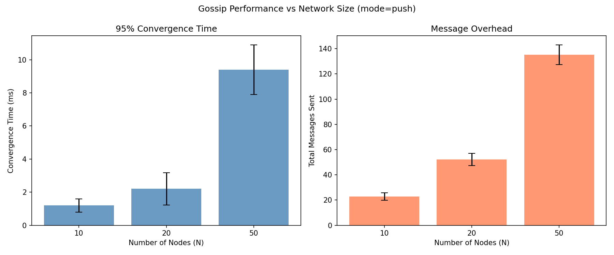
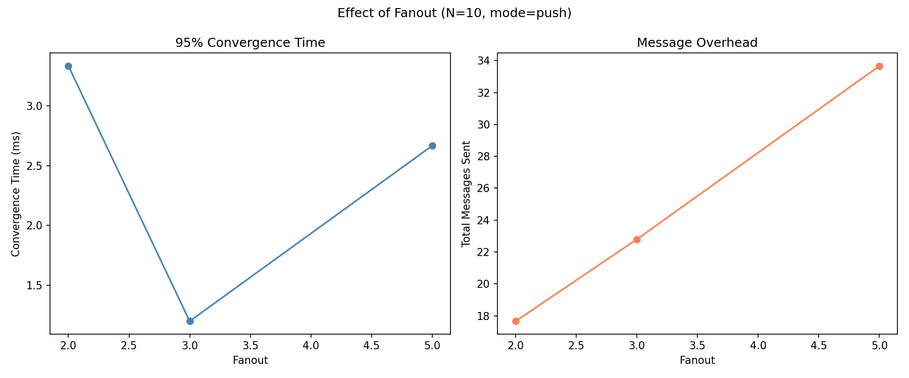
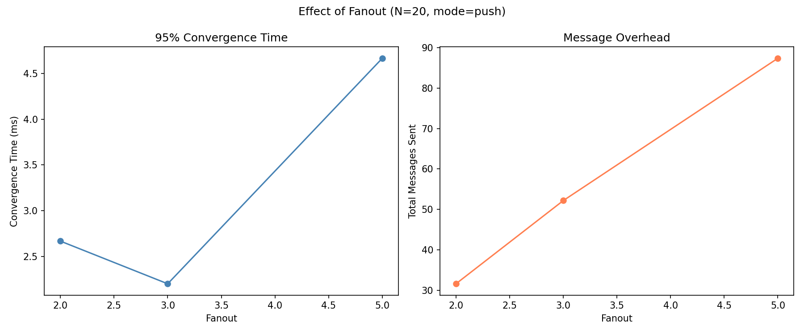
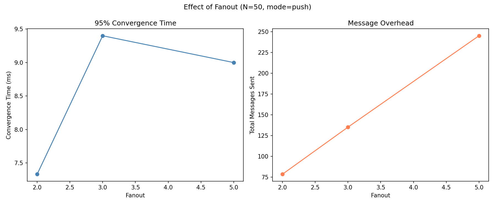
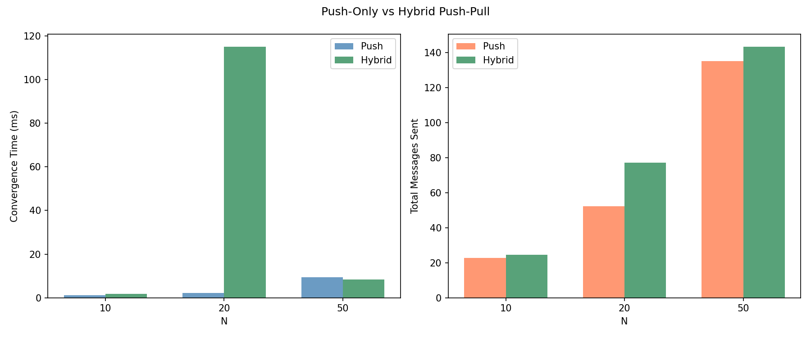
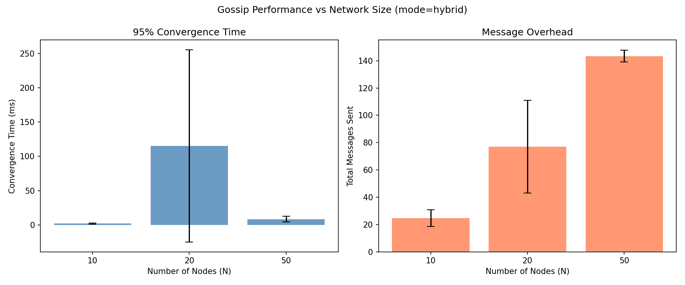

# Gossip Protocol for P2P Information Dissemination

A complete Python implementation of a Gossip (epidemic) protocol for peer-to-peer information dissemination over UDP. Built as a course project for **Computer Networks (40443)** — Dr. Amirmehdi Sadeghzadeh.

The protocol supports push-based gossip, hybrid push-pull dissemination, and SHA-256 Proof-of-Work for Sybil resistance. It includes an automated simulation framework and statistical analysis tooling.

---

## Table of Contents

- [Quick Start](#quick-start)
- [Architecture](#architecture)
- [Protocol Design](#protocol-design)
  - [Node State](#node-state)
  - [Message Format](#message-format)
  - [Message Types](#message-types)
  - [Protocol Logic](#protocol-logic)
- [CLI Reference](#cli-reference)
- [Testing](#testing)
- [Simulation & Analysis](#simulation--analysis)
- [Performance Results](#performance-results)
- [Hybrid Push-Pull Mode](#hybrid-push-pull-mode)
- [Proof-of-Work (Sybil Resistance)](#proof-of-work-sybil-resistance)
- [Mistakes & Lessons Learned](#mistakes--lessons-learned)
- [Key Takeaways](#key-takeaways)
- [License](#license)

---

## Quick Start

```bash
# clone and set up
git clone <repo-url>
cd Computer-Networks-40443-Project

# create a virtual environment (needed for matplotlib/numpy)
python3 -m venv .venv
source .venv/bin/activate
pip install -r requirements.txt

# start a seed node
python -m gossip --port 9000

# in another terminal, join with a second node
python -m gossip --port 9001 --bootstrap 127.0.0.1:9000

# type any text in a node's terminal to broadcast it as gossip
```

---

## Architecture

### Project Structure

```
gossip/
    __init__.py         # Package marker
    __main__.py         # CLI entry point (argparse)
    config.py           # GossipConfig dataclass (all tuneable parameters)
    message.py          # Message dataclass + JSON serialisation/deserialisation
    node.py             # GossipNode — UDP transport, peer management, all protocol logic
    pow.py              # Proof-of-Work (SHA-256 brute-force) for Sybil resistance
tests/
    helpers.py          # Shared test utilities (launch_node, check, read_log, etc.)
    test_messages.py    # Phase 1: message serialisation round-trips (49 checks)
    test_bootstrap.py   # Phase 2: 3-node bootstrap & peer discovery (6 checks)
    test_gossip_10.py   # Phase 2: 10-node gossip delivery test (12 checks)
    test_hybrid.py      # Phase 4a: push vs hybrid comparison (3 checks)
    test_pow.py         # Phase 4b: PoW computation, validation, integration (25 checks)
scripts/
    simulate.py         # Automated multi-trial simulation runner
    analyze.py          # Log parser + matplotlib chart generator
```

### Concurrency Model

Each node runs as a single-threaded asyncio process with concurrent tasks:

1. **UDP Listener** — receives datagrams, dispatches to handler methods via a pre-built lookup table
2. **Ping Loop** — periodically sends `PING` to a random subset of peers, removes dead peers after `peer_timeout`
3. **Input Loop** — reads stdin (via `run_in_executor`) to create new `GOSSIP` messages
4. **Pull Loop** *(hybrid mode only)* — periodically sends `IHAVE` messages to peers

The UDP socket is managed by `asyncio.DatagramProtocol`. All message handling is synchronous (no `await` in handlers), keeping the hot path fast.

### Key Design Decisions

- **UDP over TCP**: as required by the project spec. Gossip is tolerant of packet loss by design — redundant forwarding provides natural reliability.
- **JSON serialisation**: human-readable, easy to debug in logs, and the project scope doesn't demand the efficiency of binary formats.
- **`asyncio` over threads**: a single event loop avoids lock contention and is simpler to reason about than multi-threaded peer state.
- **Seeded RNG per node**: each node gets its own `random.Random(seed)` instance, making experiments reproducible while varying behaviour across nodes.
- **Bounded data structures**: the seen-set and message store use `OrderedDict` capped at 10,000 entries with FIFO eviction, preventing unbounded memory growth in long-running nodes.

---

## Protocol Design

### Node State

Each node maintains:

| State | Type | Description |
|-------|------|-------------|
| `node_id` | `str` (UUID hex) | Unique identifier, independent of address |
| `addr` | `str` ("ip:port") | This node's listening address |
| `peers` | `dict[str, PeerInfo]` | Known neighbours: addr -> (node_id, addr, last_seen) |
| `seen` | `OrderedDict[str, bool]` | Message IDs already processed (bounded, FIFO eviction at 10K) |
| `message_store` | `OrderedDict[str, Message]` | Full messages for IWANT responses (bounded, same cap) |
| `_pending_pings` | `dict[str, float]` | Outstanding ping_id -> send_time (stale entries cleaned each cycle) |

### Message Format

All messages are JSON-encoded UTF-8 over UDP, with a common header:

```json
{
    "version": 1,
    "msg_id": "uuid-hex",
    "msg_type": "HELLO | GET_PEERS | PEERS_LIST | GOSSIP | PING | PONG | IHAVE | IWANT",
    "sender_id": "node-uuid",
    "sender_addr": "127.0.0.1:8000",
    "timestamp_ms": 1730000000000,
    "ttl": 8,
    "payload": { ... }
}
```

### Message Types

| Type | Purpose | Payload Fields |
|------|---------|---------------|
| `HELLO` | Introduce a new node to the network | `capabilities`, optional `pow` |
| `GET_PEERS` | Request a node's neighbour list | `max_peers` |
| `PEERS_LIST` | Reply with known peers | `peers` (list of {node_id, addr}) |
| `GOSSIP` | Disseminate information | `topic`, `data`, `origin_id`, `origin_timestamp_ms` |
| `PING` | Liveness probe | `ping_id`, `seq` |
| `PONG` | Liveness response | `ping_id`, `seq` |
| `IHAVE` | Announce held message IDs (hybrid) | `ids`, `max_ids` |
| `IWANT` | Request full messages by ID (hybrid) | `ids` |

### Protocol Logic

#### Bootstrap (joining the network)

1. New node sends `HELLO` + `GET_PEERS` to the seed node
2. Seed responds with `PEERS_LIST`
3. New node adds received peers and can discover more via transitive `GET_PEERS`
4. If no peers appear, bootstrap retries up to 5 times with linear backoff (0.5s, 1s, 1.5s, ...)

#### Gossip Dissemination

1. On receiving a `GOSSIP` message, check `msg_id` against the seen-set. If already seen, drop it.
2. Record in seen-set + message store.
3. Decrement TTL. If TTL > 0, forward to `fanout` randomly-selected peers (excluding the sender).
4. The forwarded message preserves the original `msg_id` and `origin_timestamp_ms` for analysis.

#### Peer Management

- **Liveness**: every `ping_interval` seconds, ping up to `fanout` random peers. Peers that haven't responded within `peer_timeout` are removed.
- **Capacity**: the peer list is capped at `peer_limit`. When full, the least-recently-seen peer is evicted.
- **Dead peer removal**: stale `_pending_pings` entries are cleaned up each ping cycle to prevent memory leaks.

---

## CLI Reference

```
python -m gossip [OPTIONS]

  --port              Port to listen on (default: 8000)
  --bootstrap         ip:port of seed node (omit for seed node itself)
  --fanout            Peers to forward each GOSSIP to (default: 3)
  --ttl               Max hops for GOSSIP messages (default: 8)
  --peer-limit        Max neighbours to keep (default: 20)
  --ping-interval     Seconds between PING rounds (default: 2.0)
  --peer-timeout      Seconds before peer considered dead (default: 6.0)
  --seed              RNG seed for reproducibility (default: 42)
  --mode              "push" or "hybrid" (default: push)
  --pull-interval     Seconds between IHAVE rounds in hybrid mode (default: 2.0)
  --ihave-max-ids     Max msg_ids per IHAVE message (default: 32)
  --pow-k             PoW difficulty — leading hex zeros required (default: 0 = off)
```

---

## Testing

All tests are manual scripts (no pytest dependency) that launch real nodes as subprocesses and inspect log files for expected behaviour.

```bash
# Phase 1 — message serialisation (49 checks, ~0.5s)
python tests/test_messages.py

# Phase 2 — bootstrap & peer discovery (6 checks, ~7s)
python tests/test_bootstrap.py

# Phase 2 — 10-node gossip delivery (12 checks, ~13s)
python tests/test_gossip_10.py

# Phase 4a — push vs hybrid comparison (3 checks, ~30s)
python tests/test_hybrid.py

# Phase 4b — PoW computation, validation, timing, integration (25 checks, ~20s)
python tests/test_pow.py
```

All test files import shared utilities from `tests/helpers.py` (node launching, log reading, assertion helpers, process cleanup).

---

## Simulation & Analysis

### Running Simulations

```bash
source .venv/bin/activate

# full simulation: N={10,20,50}, 5 seeds each, push mode
python scripts/simulate.py

# vary fanout values
python scripts/simulate.py --sizes 10 20 50 --seeds 3 --fanouts 2 3 5

# hybrid mode
python scripts/simulate.py --sizes 10 20 50 --seeds 5 --mode hybrid

# both modes for comparison
python scripts/simulate.py --sizes 10 20 50 --seeds 5 --mode both

# quick smoke test
python scripts/simulate.py --sizes 10 --seeds 1
```

### Generating Charts

```bash
python scripts/analyze.py
```

The analyzer:
1. Parses log files from `results/` to extract event timestamps
2. Computes **Convergence Time** (time for 95% of nodes to receive the message)
3. Computes **Message Overhead** (total messages sent within the gossip propagation window `[t0, t_converged]`)
4. Generates comparative bar charts and line plots saved to `charts/`
5. Prints a summary table with mean +/- standard deviation across trials

### Metrics Definitions

| Metric | Definition |
|--------|-----------|
| **Convergence Time** | Milliseconds from the originator's GOSSIP creation (`t0`) until 95% of nodes have received it |
| **Message Overhead** | Total number of messages (all types) sent by all nodes during `[t0, t_converged]` |
| **Delivery Ratio** | Fraction of nodes that received the gossip message |

---

## Performance Results

Results from simulation with fanout=3, TTL=8, 5 seeds per configuration.

### Convergence Time & Overhead vs Network Size (Push Mode)



| N  | Convergence (ms) | Overhead (msgs) | Delivery       |
|----|-------------------|-----------------|----------------|
| 10 | 1 +/- 0          | 23 +/- 3        | 98.0% +/- 4.0% |
| 20 | 2 +/- 1          | 52 +/- 5        | 95.0% +/- 5.5% |
| 50 | 9 +/- 1          | 135 +/- 8       | 97.6% +/- 1.5% |

### Effect of Fanout (Push Mode)

<details>
<summary>N = 10</summary>


</details>

<details>
<summary>N = 20</summary>


</details>

<details>
<summary>N = 50</summary>


</details>

| Fanout | Convergence (ms) | Overhead (msgs) | Delivery        |
|--------|-------------------|-----------------|-----------------|
| 2      | 7 +/- 2          | 79 +/- 3        | 82.7% +/- 4.7%  |
| 3      | 9 +/- 1          | 135 +/- 8       | 97.6% +/- 1.5%  |
| 5      | 9 +/- 3          | 245 +/- 5       | 100.0% +/- 0.0% |

**Observations:**
- Convergence time scales logarithmically with N (expected for epidemic protocols).
- Fanout=2 drops delivery below 90% — insufficient redundancy. Fanout=3 is the sweet spot for this network size.
- Overhead grows roughly linearly with N (each node forwards to `fanout` peers).

### Push vs Hybrid (fanout=3, TTL=8)



| N  | Mode   | Convergence (ms) | Overhead (msgs) | Delivery        |
|----|--------|-------------------|-----------------|-----------------|
| 10 | push   | 1 +/- 0          | 23 +/- 3        | 98.0% +/- 4.0%  |
| 10 | hybrid | 2 +/- 1          | 25 +/- 6        | 100.0% +/- 0.0% |
| 50 | push   | 9 +/- 1          | 135 +/- 8       | 97.6% +/- 1.5%  |
| 50 | hybrid | 8 +/- 4          | 143 +/- 4       | 100.0% +/- 0.0% |

### Convergence Time & Overhead vs Network Size (Hybrid Mode)



**Observations:**
- Hybrid mode consistently achieves 100% delivery by recovering missed messages via IHAVE/IWANT.
- The overhead cost of IHAVE/IWANT is modest (~5-10% increase).
- Convergence time is comparable; the pull mechanism fills gaps without slowing down push.

---

## Hybrid Push-Pull Mode

In standard push-only gossip, messages can be lost if a node has too few peers or unlucky random selection. The hybrid mode adds a lightweight pull mechanism:

1. **IHAVE** — every `pull_interval` seconds, each node sends a list of its recent `msg_id`s to `fanout` random peers
2. **IWANT** — if a peer sees `msg_id`s it hasn't received, it requests the full messages
3. **GOSSIP reply** — the original holder sends the full message with TTL=1 (direct delivery, no further forwarding)

This combines the speed of push with the reliability of pull, achieving 100% delivery with minimal extra overhead.

**CLI:**
```bash
python -m gossip --port 9000 --mode hybrid --pull-interval 2 --ihave-max-ids 32
```

---

## Proof-of-Work (Sybil Resistance)

### Mechanism

To prevent Sybil attacks (an adversary flooding the network with fake nodes), joining nodes must solve a SHA-256 hash puzzle:

- Find a `nonce` such that `SHA-256(node_id || nonce)` starts with `k` leading hex zeros
- Include the proof in the `HELLO` message payload
- The receiving node validates the proof before accepting the peer

### PoW Timing (SHA-256, Apple M-series)

| k (hex zeros) | Mean Time  | Range            |
|---------------|------------|------------------|
| 2             | ~0.1 ms    | 0 - 0.2 ms      |
| 3             | ~1.2 ms    | 0.7 - 1.8 ms    |
| 4             | ~48 ms     | 8 - 85 ms       |
| 5             | ~530 ms    | 63 - 985 ms     |

**Recommended k=4**: takes ~50ms on average (imperceptible for legitimate users), but an attacker creating 1,000 fake nodes would need ~50 seconds of CPU time. Each additional k roughly multiplies cost by 16x.

### Security Analysis

- **Cost for attackers**: with k=4, each fake identity costs ~50ms of CPU. Creating 10,000 Sybil nodes takes ~8 minutes of continuous computation — a meaningful barrier.
- **Cost for legitimate users**: a single PoW at k=4 is computed in the background (via `run_in_executor`) while the node's event loop remains responsive.
- **Limitations**: PoW doesn't prevent well-resourced attackers. It raises the floor, making casual Sybil attacks impractical.

**CLI:**
```bash
# seed node requires PoW
python -m gossip --port 9000 --pow-k 4

# joining node computes PoW automatically
python -m gossip --port 9001 --bootstrap 127.0.0.1:9000 --pow-k 4
```

---

## Mistakes & Lessons Learned

Throughout the implementation we encountered several bugs and design mistakes. Documenting them here as a reference for what to watch out for in distributed systems projects.

### 1. Unbounded Data Structures (Memory Leak)

**What happened:** The `seen` set and `message_store` dictionary grew without limit. In a long-running node processing thousands of messages, memory usage would climb indefinitely.

**Fix:** Replaced the plain `set` and `dict` with `collections.OrderedDict` capped at 10,000 entries. Oldest entries are evicted via FIFO when the limit is reached. The same issue affected `_pending_pings` — PING entries that never received a PONG accumulated forever. Fixed by cleaning stale pings each cycle.

**Lesson:** In any system that accumulates state over time, always define a retention policy. Unbounded collections are a classic source of production memory leaks.

### 2. Blocking the Event Loop with PoW

**What happened:** The `compute_pow()` function performs a CPU-intensive brute-force search (up to ~1 second for k=5). Initially it was called with a bare `await`-less function call directly in the `run()` method, which blocked the entire asyncio event loop. During PoW computation, the node couldn't receive or process any messages.

**Fix:** Moved the computation to `loop.run_in_executor(None, compute_pow, ...)`, which runs it in a thread pool while the event loop remains responsive.

**Lesson:** Never perform CPU-bound work directly in an asyncio coroutine. Always offload to an executor or a separate process.

### 3. Logger Clobbering Across Nodes

**What happened:** All nodes used the same `logging.getLogger("gossip")` logger. Each node's `_setup_logging()` called `root.handlers.clear()` and re-added its own handlers. If multiple nodes ran in the same process (e.g., during testing), the last node to initialise would wipe the earlier nodes' log handlers.

**Fix:** Each node now creates its own logger via `logging.getLogger(f"gossip.{port}")` with `propagate = False`. No more shared mutable state.

**Lesson:** Shared global state (like module-level loggers) is a trap when running multiple instances. Scope resources to the instance level wherever possible.

### 4. `stop()` Cancelled All Tasks in the Event Loop

**What happened:** The `stop()` method iterated over `asyncio.all_tasks(self.loop)` and cancelled every one — including tasks belonging to *other* nodes or the test harness itself.

**Fix:** The node now tracks its own tasks in `self._tasks` and only cancels those.

**Lesson:** In shared event loops, scope your cancellation to your own tasks. `asyncio.all_tasks()` is a sledgehammer that breaks multi-tenancy.

### 5. Reconstructing Messages Per Target (Wasteful)

**What happened:** In both `_broadcast_gossip` and `_forward_gossip`, a new `Message` object was constructed inside the inner loop for *each* target peer. This meant creating 3 identical objects instead of 1 for a fanout of 3.

**Fix:** Build the message once, reuse the same instance for all `sendto()` calls.

**Lesson:** Move invariant work out of loops. Even when the cost per iteration is small, the pattern signals that something is wrong.

### 6. Bootstrap Had No Retry Logic

**What happened:** If the seed node hadn't fully started when a new node sent its `HELLO` + `GET_PEERS`, the messages were silently lost (UDP has no delivery guarantee). The joining node would have zero peers forever.

**Fix:** Bootstrap now retries up to 5 times with increasing delay (0.5s, 1.0s, 1.5s, ...), stopping early as soon as any peer appears.

**Lesson:** Fire-and-forget over UDP is fragile. Any critical operation should have a retry strategy, especially during initialisation.

### 7. Overhead Metric Counted Entire Node Lifetime

**What happened:** The analysis script counted *all* `SENT` log entries across the entire run (including bootstrap HELLO/GET_PEERS, PING/PONG, and long idle periods), not just the messages sent during gossip propagation. This inflated overhead figures (e.g., 6364 instead of 135 for N=50).

**Fix:** Filter `SENT` events to the time window `[t0, t_converged]`, where t0 is when the gossip was created and t_converged is when 95% delivery was reached.

**Lesson:** Metrics must be scoped correctly. Measuring the wrong window gives misleading results that undermine the entire analysis.

### 8. PoW `elapsed_ms` Leaked in Wire Payload

**What happened:** The `compute_pow()` return dict includes an `elapsed_ms` field for local diagnostics. This was sent verbatim in the `HELLO` payload, leaking information about the sender's hardware speed to all peers.

**Fix:** The `Message.hello()` factory now strips `elapsed_ms` before serialising the payload.

**Lesson:** Distinguish between internal diagnostics and wire protocol data. Don't send anything over the network that the receiver doesn't need.

### 9. Signal Handler Blocked Test Subprocess Termination

**What happened:** We registered `signal.SIGTERM` handlers for graceful shutdown. But test scripts use `subprocess.Popen.terminate()` which sends SIGTERM. Our handler tried to do a graceful shutdown (cancel tasks, close transport), but the stdin reader thread was blocked on `readline()` and prevented the process from exiting. Tests hung indefinitely.

**Fix:** Only register a signal handler for `SIGINT` (Ctrl-C). Leave `SIGTERM` at its default (immediate kill) so that `terminate()` from test harnesses works correctly.

**Lesson:** Be careful about overriding default signal handlers. Consider how the process is managed (interactive use vs subprocess) and test both paths.

---

## Key Takeaways

1. **Epidemic protocols are elegant**: with just a fanout of 3 and TTL of 8, gossip reliably reaches 95%+ of a 50-node network in under 10ms. The redundancy makes it naturally fault-tolerant.

2. **Hybrid push-pull is strictly better**: for a modest (~5-10%) increase in message overhead, hybrid mode closes the delivery gap to 100%. In any production system, the pull mechanism is worth the cost.

3. **Bounded everything**: seen-sets, peer lists, pending pings — every collection that grows over time needs a cap and an eviction policy. This is the #1 operational concern in long-running distributed systems.

4. **Don't block the event loop**: asyncio's cooperative concurrency model means one CPU-bound call stalls *all* concurrent work. Always offload heavy computation to an executor.

5. **Scope your resources**: loggers, tasks, cancellation — anything shared across instances is a landmine. Per-instance scoping is simpler and more correct.

6. **Test what you measure**: the overhead metric was wrong for several iterations because we measured the wrong time window. Define your metrics precisely *before* implementing the analysis.

7. **UDP is fire-and-forget**: bootstrap, the most critical phase, had no retry logic. Any non-idempotent operation over UDP needs explicit retries with backoff.

8. **Manual tests with real processes are invaluable**: while unit tests check logic, launching actual nodes as subprocesses catches integration issues (port conflicts, signal handling, stdin EOF behaviour) that no mock can replicate.

9. **PoW is a speed bump, not a wall**: Proof-of-Work raises the cost of Sybil attacks but doesn't prevent them against well-resourced adversaries. It's one layer in a defence-in-depth strategy.

10. **Simple is better**: the entire protocol implementation fits in ~530 lines of Python across 5 files. Readable code is debuggable code. Every line of complexity is a line that can hide a bug.

---

## License

This project is licensed under the **GNU General Public License v3.0** — see the [LICENSE](LICENSE) file for details.
